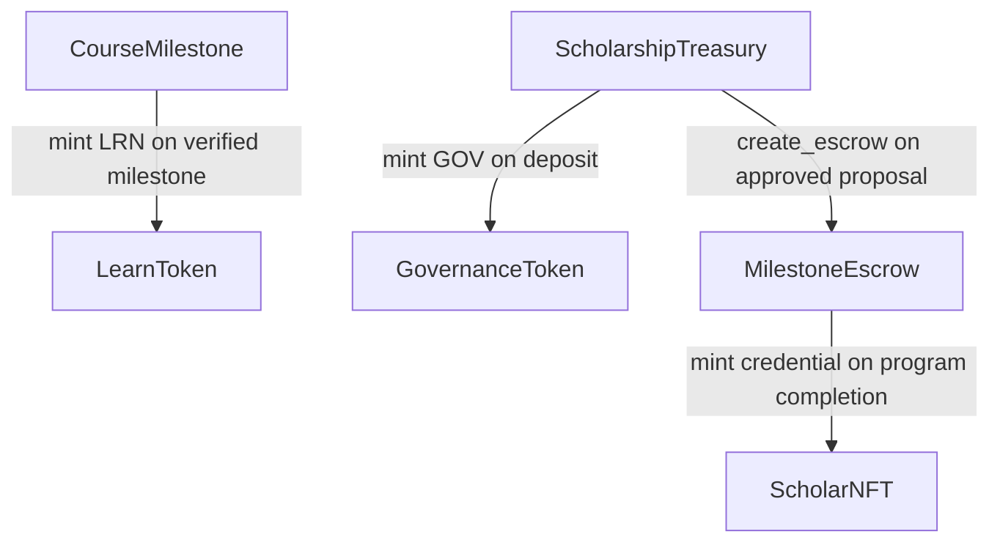

# LearnVault Smart Contract Reference

## Contract Overview

| Contract | Language | Purpose |
|---|---|---|
| `LearnToken` | Soroban/Rust | Soulbound reputation token (LRN) — minted on milestone completion, non-transferable |
| `GovernanceToken` | Soroban/Rust | Transferable DAO voting token (GOV) — minted to donors on deposit, earned by top learners |
| `CourseMilestone` | Soroban/Rust | Tracks learner progress per course, triggers LRN minting on verified checkpoint completion |
| `ScholarshipTreasury` | Soroban/Rust | Holds donor USDC funds, mints GOV to donors, creates escrows for approved proposals |
| `MilestoneEscrow` | Soroban/Rust | Manages tranche disbursements to scholars, returns unspent funds after 30-day inactivity |
| `ScholarNFT` | Soroban/Rust | Soulbound credential NFT minted to scholars who complete their funded program |

---

## Contract Interaction Diagram

**Interaction summary:**

- `CourseMilestone` → `LearnToken`: calls `mint` when a learner's checkpoint is verified
- `ScholarshipTreasury` → `GovernanceToken`: calls `mint` proportional to a donor's USDC deposit
- `ScholarshipTreasury` → `MilestoneEscrow`: calls `create_escrow` when a scholarship proposal passes DAO vote
- `MilestoneEscrow` → `ScholarNFT`: calls `mint` when a scholar completes all funded milestones

---

## Deployment Order

Contracts must be deployed in this order due to cross-contract dependencies:

1. **`LearnToken`** — no dependencies
2. **`GovernanceToken`** — no dependencies
3. **`ScholarNFT`** — no dependencies
4. **`CourseMilestone`** — requires `LearnToken` address
5. **`ScholarshipTreasury`** — requires `GovernanceToken` address
6. **`MilestoneEscrow`** — requires `ScholarshipTreasury` and `ScholarNFT` addresses

---

## Testnet Addresses

> Fill in after deployment to Stellar Testnet.

| Contract | Testnet Address |
|---|---|
| `LearnToken` | — |
| `GovernanceToken` | — |
| `CourseMilestone` | — |
| `ScholarshipTreasury` | — |
| `MilestoneEscrow` | — |
| `ScholarNFT` | — |
